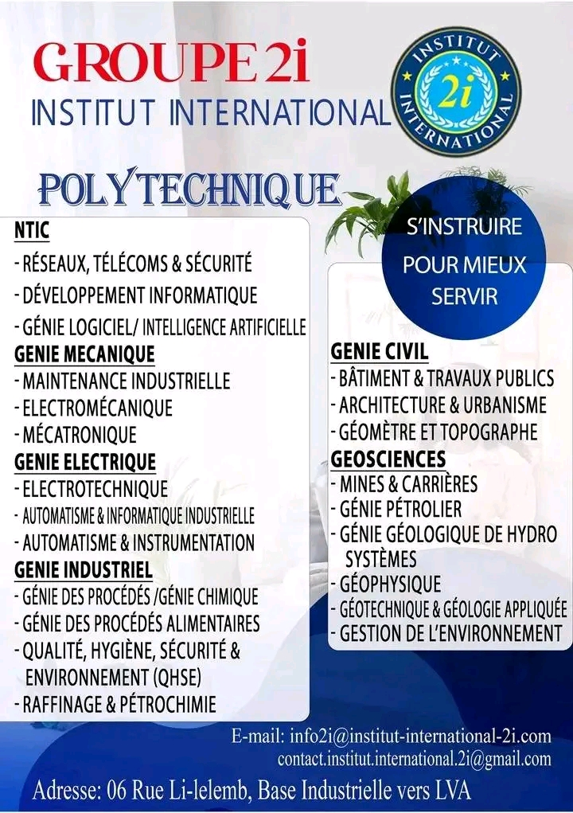

# 📚 Institut International 2i - Polytechnique, Commerce et Droit  

Bienvenue sur le dépôt officiel de l'**Institut International 2i** ! Nous proposons des formations de qualité en **Sciences Polytechniques, Commerce et Droit** pour préparer les leaders de demain.  

---

## 🎯 Objectif du Projet  

Ce dépôt regroupe les ressources pédagogiques, les supports de cours et les informations essentielles pour les étudiants et enseignants de l'Institut.  

## 🏫 Nos Filières  

### 🔹 Polytechnique  
💡 **Formations disponibles :**  

 

---

### 🔹 Commerce  
💼 **Formations disponibles :**  

---

### 🔹 Droit  
⚖️ **Formations disponibles :**  

## 📌 Comment Contribuer ?  
1. **travailler plus dur**  
 
  nous avons besoin de beaucoup plus de membres  et de la main d'oeuvre pour que toutes les filières confondues puissent communiquer efficacement pour de meilleurs résultats
 

📩 *Pour toute question, contactez-nous !*  

---

## 📞 Contact  
📍 **Institut International 2i**  
🌐 Site web : [www.institut2i.com](#)  
✉️ [Numéro]: (https://wa.me/+242056326534) 

🚀 *Merci de votre visite et bonne exploration !*  

---